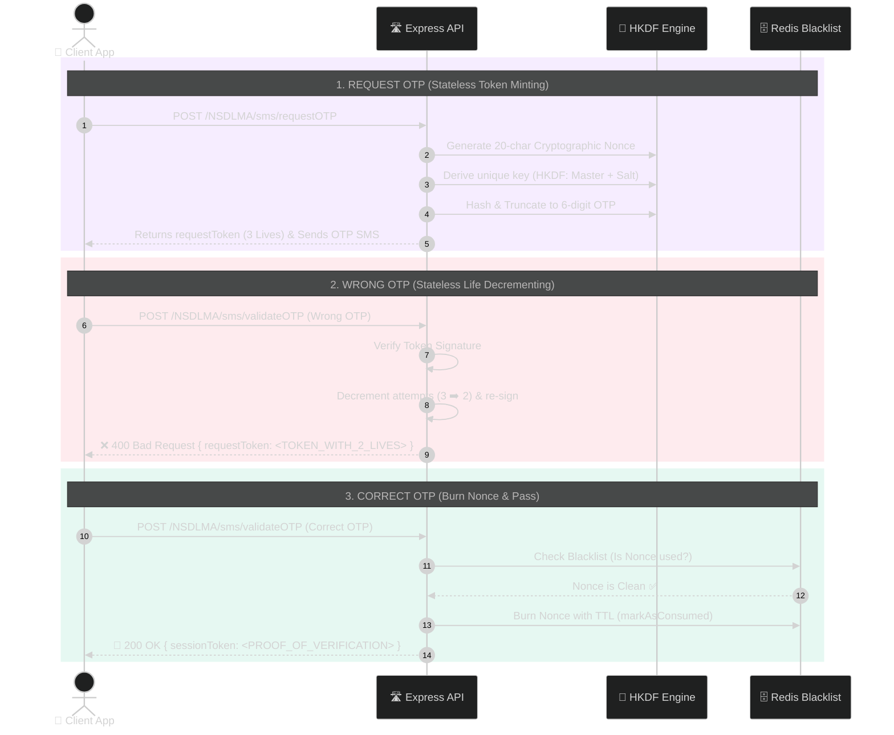

<div align="center">

# ⚡ HTOTP v2 — Hybrid Time-Nonce OTP Service
### *Zero-Database • Ephemeral Cryptography • Brute-Force Immune • Infinite Scale*

[](https://github.com)
[](walkthrough.md)
[](walkthrough.md)
[](tests/)
[](walkthrough.md)
[]()

<br/>

```
  ┌────────────────────────────────────────────────────────────────────────┐
  │                                                                        │
  │     [ Client App ]  ◄──────  Signed RequestToken (3 Lives)  ──────┐    │
  │            │                                                      │    │
  │     1. POST /request-otp                                          │    │
  │            ▼                                                      │    │
  │     [ HTOTP Engine ] ────►  HKDF(MasterKey + Salt)  ────► [ OTP SMS ]  │
  │            │                                                           │
  │     2. POST /validate-otp (Token + OTP)                                │
  │            ▼                                                           │
  │     [ Redis Blacklist ] ──► Burns Nonce (Replay Protected) ──► [ VIP ] │
  │                                                                        │
  └────────────────────────────────────────────────────────────────────────┘
```

**HTOTP (Hybrid Time-Nonce One-Time Password)** is a next-generation authentication microservice designed to eliminate database bottlenecks and common TOTP vulnerabilities. By merging RFC 5869 HKDF key derivation with signed, self-contained attempt tokens, it offers bank-grade security with zero persistent storage overhead.

[Explore Interactive Guide](totp-flow-interactive.html) • [Read Full Walkthrough](walkthrough.md) • [View API Docs](#-api-quick-reference)

---

</div>

## 🌟 Why HTOTP v2?

Traditional OTP services require continuous database writes (`INSERT / UPDATE`), creating slow bottlenecks and single-point-of-failures. Standard TOTP fixes scaling but introduces **replay attacks** and **brute-force blind spots**. 

**HTOTP v2 solves every edge case:**

| Feature | Legacy DB OTP 🎒 | Standard TOTP ⏱️ | **HTOTP v2 (This Service) ⚡** |
| :--- | :--- | :--- | :--- |
| **Database Overhead** | High (Heavy DB writes) | Zero | **Zero (Stateless Architecture)** |
| **Horizontal Scaling** | Hard (DB contention) | Seamless | **Infinite (Stateless token verification)** |
| **Replay Protection** | Medium (DB cleanup) | ❌ Vulnerable (within window) | **✅ 100% Immune (Redis single-use Nonce burn)** |
| **Brute-Force Shield** | Handled via DB locks | ❌ Vulnerable (stateless blind spot) | **✅ 100% Protected (Token-embedded attempt lives)** |
| **Context Isolation** | Manual DB flags | ❌ None | **✅ Cryptographically bound (`txContext`)** |

---

## 🎨 Visual Service Flow



---

## 🔑 Core Cryptographic Principles

### 1. 🧬 RFC 5869 HKDF Key Derivation
Instead of storing permanent secret keys per user, a single global `HTOTP_MASTER_KEY` is combined with a dynamic salt (`channel:identity:nonce`) on the fly. 
```javascript
const salt = `${channel}:${identity}:${nonce}`;
const derivedKey = crypto.hkdfSync('sha256', MASTER_KEY, salt, 'HTOTP-v1', 32);
```

### 2. 🎟️ Stateless Attempt Decrementing (3 Lives)
The `requestToken` is a tamper-proof signed envelope carrying `{ nonce, txContext, attempts: 3, exp }`. If an incorrect OTP is supplied, the server decrements `attempts`, re-signs the token, and returns it with a `400 Bad Request`. When attempts hit `0`, the token is permanently invalidated.

### 3. 🔥 High-Speed Nonce Blacklisting
Upon successful OTP validation, the unique 20-character `nonce` is committed to Redis with a strict 120-second TTL (`markAsConsumed(nonce)`). Any secondary submission with the same token is violently blocked.

---

## 📡 API Quick Reference

### Base URL: `http://localhost:8080/NSDLMA/sms`

| Endpoint | Method | Payload Summary | Purpose |
| :--- | :---: | :--- | :--- |
| `/requestOTP` | `POST` | `mobileNumber`, `channel`, `params`, `bankCode` | Generates OTP & returns initial `requestToken` |
| `/resendOTP` | `POST` | `requestToken`, `messageData` | Derives *new* nonce & dispatches fresh OTP |
| `/validateOTP` | `POST` | `requestToken`, `otp` | Validates code, burns nonce, returns `sessionToken` |

<details>
<summary><b>🔍 View Example Request & Response Payloads</b></summary>

#### Request OTP (`POST /requestOTP`)
```json
// Request
{
  "mobileNumber": "9876543210",
  "channel": "SMS",
  "bankCode": "IDBI",
  "feature": "LOGIN",
  "params": "user_session_4920",
  "messageData": { "template": "otp_sms" }
}

// Response (200 OK)
{
  "status": "SUCCESS",
  "message": "OTP sent successfully",
  "data": {
    "requestToken": "eyJhbGciOiJIUzI1Ni... (HMAC Signed)"
  }
}
```

#### Validate OTP (`POST /validateOTP`)
```json
// Request
{
  "requestToken": "<TOKEN_FROM_REQUEST_OTP>",
  "otp": "482910"
}

// Success Response (200 OK)
{
  "status": "SUCCESS",
  "message": "OTP verified successfully",
  "data": {
    "sessionToken": "eyJhbGciOiJIUzI1Ni... (Verified VIP Ticket)"
  }
}
```
</details>

---

## 🚀 Quickstart & Setup

### 1. Clone & Install
```bash
git clone https://github.com/Kuldeep-Pradhan/totp_service.git
cd totp_service
npm install
```

### 2. Configure Environment
Copy the sample environment file:
```bash
cp environment/.env.example environment/.env.development
```

### 3. Run Tests
```bash
npm test
```

### 4. Start Server
```bash
npm run dev
```

* 📄 **Swagger Interactive Docs:** `http://localhost:8080/api-docs`
* 🎮 **Visual Sandbox & Stepper:** Open `totp-flow-interactive.html` directly in your browser!

---

## 🧪 Security & Verification Matrix

- [x] **Timing-Attack Proof:** Constant-time buffer comparison via `crypto.timingSafeEqual`.
- [x] **Tamper Proof:** HMAC-SHA256 signature verification over every token payload.
- [x] **Channel & TxContext Bound:** OTP hashes strictly coupled to the action context.
- [x] **Unit & E2E Coverage:** 38/38 automated Jest suites covering algorithms, edge cases, and rate limiters.

---

<div align="center">
  <sub>Engineered with precision for resilient, high-throughput authentication.</sub>
</div>
