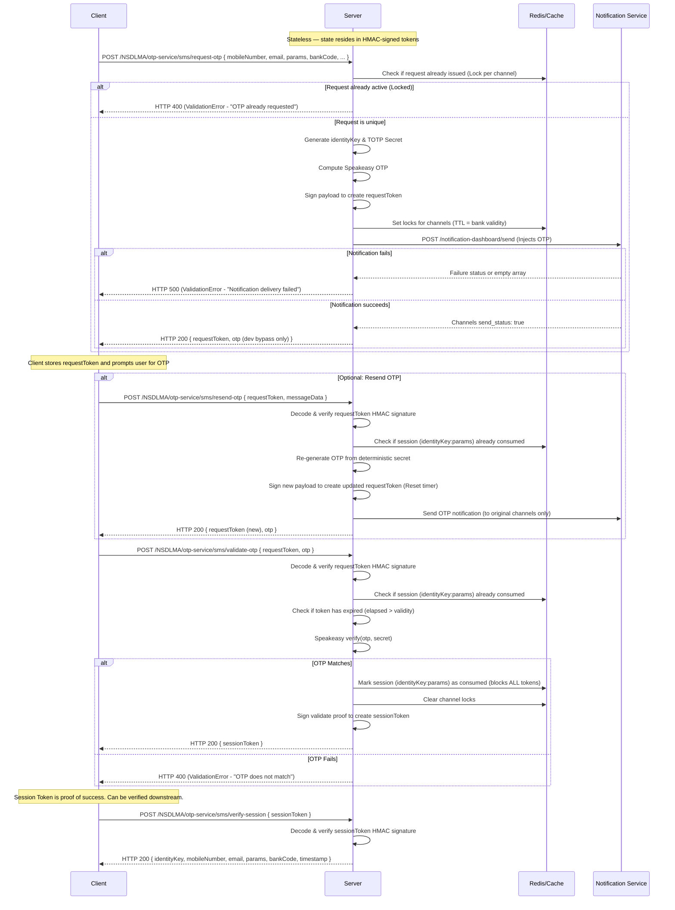

# OTP Service - Stateless TOTP API Documentation (v2.1)

This documentation specifies the API reference and system architecture for the Stateless Time-Based One-Time Password (TOTP) backend. The service requires zero database or in-memory tables for tracking active OTP codes; all state is cryptographically signed and stored by the client in HMAC-SHA256 tokens.

---

# 📚 System Architecture & Flow

The Stateless TOTP engine uses the **Speakeasy** library with a deterministic secret generator:
$$\text{Secret} = \text{HMAC-SHA256}(\text{TOTP\_MASTER\_KEY}, \text{identityKey} + \text{params})$$

### 🔗 Identity Key & Channels
The service supports multi-channel OTP delivery (SMS and/or Email).
* **Identity Key Formulation**: Built using `buildIdentityKey(mobileNumber, email)`.
  * If both are provided: `"9876543210:user@example.com"`
  * If only mobile: `"9876543210"`
  * If only email: `"user@example.com"`
* **Verification Logic**: Either a valid 10-digit mobile number OR a valid email format is required.

### 🛡️ Cache & Replay Protection
To prevent OTP replay attacks and double requests:
* **Duplicate Prevention (`isRequestIssued`)**: Caches transaction identifiers in Redis. If Redis is disconnected, it falls back to a local `node-cache` store.
* **Opportunistic Sync**: If Redis reconnects after a disconnect, cached keys are pushed back to Redis from local memory and cleared locally.
* **Replay Prevention (`isConsumed`)**: When an OTP is successfully validated, the logical session key (`identityKey:params`) is marked as consumed — blocking ALL tokens for that session, not just the specific one used.

### 🔔 Blocking Notifications
Before returning the `requestToken`, the server triggers a blocking call to the Notification Dashboard API:
* If the notification fails (e.g. invalid response, `send_status` is false on any channel), the server throws a `ValidationError` (status code 500) and halts OTP generation. This prevents spamming invalid/broken destinations.

### 🔒 Email Injection Prevention
The `/resend-otp` endpoint strictly uses contact channels (mobile + email) embedded inside the HMAC-signed `requestToken`. Any `email` or `mobileNumber` provided in the resend request body is ignored to prevent an attacker from injecting their own address.

---

## 🔁 Complete Transaction Lifecycle Flow



---

# 📌 API Reference

### Base URL

| Environment | Base URL |
|---|---|
| **Local** | `http://localhost:8080` |
| **Staging** | *(To be provided)* |
| **UAT** | *(To be provided)* |
| **Production** | *(To be provided)* |

### Common Status Codes in Response
* `0` — Success / True
* `-1` / `400` / `500` — Validation / System Failure

---

## 1️⃣ Heartbeat Check
Verify if the OTP microservice is up and active.

* **Endpoint:** `GET /NSDLMA/otp-service/HbtChk`
* **Full URL:** `{{baseUrl}}/NSDLMA/otp-service/HbtChk`
* **Response Format:** `application/json`

#### ✅ Success Response (HTTP 200)
```json
{
  "status": "UP",
  "timestamp": "2026-06-03T10:00:00.000Z",
  "service": "totp-service",
  "version": "2.0.0"
}
```

---

## 2️⃣ Request OTP
Generates a new stateless OTP and issues a cryptographic `requestToken` representing the active request state.

* **Endpoint:** `POST /NSDLMA/otp-service/sms/request-otp`
* **Full URL:** `{{baseUrl}}/NSDLMA/otp-service/sms/request-otp`
* **Content-Type:** `application/json`

#### 📥 Request Body
```json
{
  "user_name": "john_doe",
  "mobileNumber": "9876543210",
  "email": "john_doe@example.com",
  "params": "txn123456abcd",
  "bankCode": "IDBI",
  "feature": "LOGIN",
  "operationPerformed": "OTP_VERIFICATION",
  "messageData": {
    "template": "otp_sms"
  },
  "status": "SUCCESS"
}
```

#### 📋 Parameter Validation Details
* `user_name` (String, Required)
* `mobileNumber` (String, Optional) - Must match `^[6-9]\d{9}$` if provided.
* `email` (String, Optional) - Valid email syntax.
* **Requirement**: At least one of `mobileNumber` or `email` must be provided and non-empty.
* `params` (String, Required) - Unique transaction payload string (10 to 150 characters).
* `bankCode` (String, Optional) - Bank identifier. Sets expiration times (e.g. `IDBI` = 5min, `SBI` = 3min, Default = 2min).
* `feature` & `operationPerformed` (String, Required)
* `messageData` (Object, Required) - Template metadata.

#### 📤 Responses

##### Success (HTTP 200)
```json
{
  "status": 0,
  "success": true,
  "displayMessage": "OTP sent successfully. (Dev mode: 382910 is your OTP)",
  "requestToken": "eyJhbGciOiJIUzI1NiIsInR5cCI6IkpXVCJ9..."
}
```

##### Failure — Locked Duplicate Request (HTTP 400)
```json
{
  "status": -1,
  "success": false,
  "displayMessage": "OTP already sent for this mobile number with the same params. Use a unique params value or resend the existing OTP.",
  "err_type": "ValidationError"
}
```

##### Failure — Notification Dispatch Failure (HTTP 500)
```json
{
  "status": -1,
  "success": false,
  "displayMessage": "Failed to deliver OTP via: SMS. Please retry with new params.",
  "err_type": "ValidationError"
}
```

---

## 3️⃣ Resend OTP
Resends the OTP using the stateless `requestToken`. Validates the token, re-generates the OTP from the deterministic secret, and issues a new token with reset expiry. **Contact channels are strictly taken from the token — no email override is allowed.**

* **Endpoint:** `POST /NSDLMA/otp-service/sms/resend-otp`
* **Full URL:** `{{baseUrl}}/NSDLMA/otp-service/sms/resend-otp`
* **Content-Type:** `application/json`

#### 📥 Request Body
```json
{
  "requestToken": "eyJhbGciOiJIUzI1NiIsInR5cCI6IkpXVCJ9.eyJpZCI6Ijk4NzY1NDMyMTA...",
  "messageData": {
    "template": "otp_sms"
  }
}
```

#### 📤 Success Response (HTTP 200)
```json
{
  "status": 0,
  "success": true,
  "displayMessage": "OTP resent successfully. (Dev mode: 482910 is your OTP)",
  "requestToken": "eyJhbGciOiJIUzI1NiIsInR5cCI6IkpXVCJ9.eyJpZCI6Ijk4NzY1NDMyMTA..."
}
```

---

## 4️⃣ Validate OTP
Validates the user-submitted OTP against the TOTP secret embedded inside the token. Marks the session (`identityKey:params`) as consumed to prevent reuse of **any** token for this session.

* **Endpoint:** `POST /NSDLMA/otp-service/sms/validate-otp`
* **Full URL:** `{{baseUrl}}/NSDLMA/otp-service/sms/validate-otp`
* **Content-Type:** `application/json`

#### 📥 Request Body
```json
{
  "requestToken": "eyJhbGciOiJIUzI1NiIsInR5cCI6IkpXVCJ9.eyJpZCI6Ijk4NzY1NDMyMTA...",
  "otp": "482910"
}
```

#### 📤 Responses

##### Success (HTTP 200)
```json
{
  "status": 0,
  "success": true,
  "displayMessage": "OTP validated successfully",
  "sessionToken": "eyJhbGciOiJIUzI1NiIsInR5cCI6IkpXVCJ9..."
}
```

##### Failure — Expired Request Token (HTTP 400)
```json
{
  "status": -1,
  "success": false,
  "displayMessage": "OTP has expired. Please request a new OTP.",
  "err_type": "ValidationError"
}
```

##### Failure — Replay Attempt / Re-verification (HTTP 400)
```json
{
  "status": -1,
  "success": false,
  "displayMessage": "This OTP has already been validated. Please request a new OTP.",
  "err_type": "ValidationError"
}
```

---

## 5️⃣ Verify Session
Verifies the authenticity and signature validity of the `sessionToken` issued upon validation success.

* **Endpoint:** `POST /NSDLMA/otp-service/sms/verify-session`
* **Full URL:** `{{baseUrl}}/NSDLMA/otp-service/sms/verify-session`
* **Content-Type:** `application/json`

#### 📥 Request Body
```json
{
  "sessionToken": "eyJhbGciOiJIUzI1NiIsInR5cCI6IkpXVCJ9..."
}
```

#### 📤 Success Response (HTTP 200)
```json
{
  "status": 0,
  "success": true,
  "displayMessage": "Session verified successfully",
  "message": "Session verified successfully",
  "data": {
    "identityKey": "9876543210:john_doe@example.com",
    "mobileNumber": "9876543210",
    "email": "john_doe@example.com",
    "params": "txn123456abcd",
    "bankCode": "IDBI",
    "timestamp": 1718294447290
  }
}
```

---

# 🧪 Testing & Verification Guide

Follow these steps using the updated Postman collection or terminal standard cURLs to verify the implementation:

### 1. Heartbeat Check
Confirm that the service is operational:
```bash
curl --location --request GET 'http://localhost:8080/NSDLMA/otp-service/HbtChk'
```

### 2. Full Success Onboarding Flow (SMS + Email)
1. **Request OTP**:
   Send a request containing username, mobile number, and email:
   ```bash
   curl --location --request POST 'http://localhost:8080/NSDLMA/otp-service/sms/request-otp' \
   --header 'Content-Type: application/json' \
   --data-raw '{
       "user_name": "john_doe",
       "mobileNumber": "9876543210",
       "email": "john_doe@example.com",
       "params": "uniqueTXN_123456",
       "bankCode": "IDBI",
       "feature": "LOGIN",
       "operationPerformed": "OTP_VERIFICATION",
       "messageData": {
           "template": "otp_sms"
       }
   }'
   ```
   * Extract the `requestToken` and the `Dev mode` OTP (e.g. `382910`) from the response.

2. **Resend OTP (Timer Reset)**:
   Verify that you can request a resend using the `requestToken`:
   ```bash
   curl --location --request POST 'http://localhost:8080/NSDLMA/otp-service/sms/resend-otp' \
   --header 'Content-Type: application/json' \
   --data-raw '{
       "requestToken": "<YOUR_REQUEST_TOKEN>",
       "messageData": {
           "template": "otp_sms"
       }
   }'
   ```
   * Notice that you receive a **new** requestToken. Use this new token for validation.

3. **Validate OTP**:
   Validate the OTP code against the token:
   ```bash
   curl --location --request POST 'http://localhost:8080/NSDLMA/otp-service/sms/validate-otp' \
   --header 'Content-Type: application/json' \
   --data-raw '{
       "requestToken": "<YOUR_NEW_REQUEST_TOKEN>",
       "otp": "382910"
   }'
   ```
   * Confirm the response returns a `sessionToken`.

4. **Verify Session Token**:
   Use the `sessionToken` to verify the state downstream:
   ```bash
   curl --location --request POST 'http://localhost:8080/NSDLMA/otp-service/sms/verify-session' \
   --header 'Content-Type: application/json' \
   --data-raw '{
       "sessionToken": "<YOUR_SESSION_TOKEN>"
   }'
   ```
   * Confirm it returns the full decoded details.

### 3. Verify Edge Cases
* **Duplicate Lock**: Send the `request-otp` curl twice in a row with the exact same `params` within 5 minutes. The second call should return `400 Bad Request` with message `OTP already requested`.
* **Replay Prevention**: Attempt to validate the OTP again with the same request token after it has already succeeded. The call must fail with `This OTP has already been validated`.
* **Session-Level Replay**: After validating with one token, try validating with a previously-issued token for the same `identityKey:params`. It must also fail — all tokens for the session are invalidated, not just the one used.
* **Bypass Validation**: In development mode (`NODE_ENV=development`), you can validate any active request using `000000` as the OTP.
* **Tampered Tokens**: Modify any letter in `requestToken` or `sessionToken` and verify that the server immediately throws `Invalid request token` / `Invalid or expired session token`.
* **Email Injection**: On `/resend-otp`, even if you pass an `email` field in the body, the notification must be sent to the original channels embedded in the token, not the injected email.
