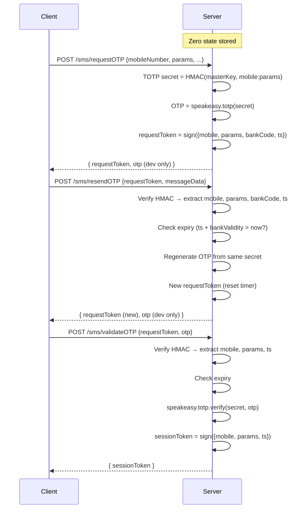

# Walkthrough: Stateless TOTP OTP Service (v2)

## What Changed (v1 → v2)

| Aspect | v1 (in-memory) | v2 (fully stateless) |
|---|---|---|
| Server state | `otpRecords` in-memory map | **Zero** — nothing stored anywhere |
| State carrier | Server tracks `createdAt`, `isValidated` | **HMAC-signed tokens** held by client |
| Resend body | Full body (mobileNumber, params, etc.) | **Just `requestToken` + `messageData`** |
| Validate body | mobileNumber, params, bankCode, otp | **Just `requestToken` + `otp`** |
| Validation proof | `isValidated` flag in memory | **`sessionToken`** returned to client |
| Scalability | Single-server only | **Horizontally scalable** — any server can verify |

## Architecture



## Optimized Request Bodies

### POST `/sms/requestOTP` — Full body
```json
{
  "user_name": "john_doe",
  "mobileNumber": "9876543210",
  "params": "txn123456abcd",
  "bankCode": "IDBI",
  "feature": "LOGIN",
  "operationPerformed": "OTP_VERIFICATION",
  "messageData": { "template": "otp_sms" }
}
```
**Response** includes `requestToken` (HMAC-signed, embeds all fields + timestamp).

### POST `/sms/resendOTP` — Optimized (2 fields only)
```json
{
  "requestToken": "<token from requestOTP>",
  "messageData": { "template": "otp_sms" }
}
```
No need to resend mobileNumber, params, bankCode — they're in the token.

### POST `/sms/validateOTP` — Minimal (2 fields only)
```json
{
  "requestToken": "<token from requestOTP or resendOTP>",
  "otp": "482910"
}
```
**Response** includes `sessionToken` — HMAC-signed proof of successful validation.

## Key Files Changed (v1 → v2)

| File | Change |
|---|---|
| [hmac.helper.js](file:///d:/Kuldeep%20Pradhan/Projects/Antigravity/otp-service/utils/helper/hmac.helper.js) | **NEW** — Request token + session token helpers with timing-safe HMAC verification |
| [sms.bl.js](file:///d:/Kuldeep%20Pradhan/Projects/Antigravity/otp-service/services/BL/sms.bl.js) | Removed `otpRecords` map. All state from tokens. Extracted notification helper |
| [sms.controller.js](file:///d:/Kuldeep%20Pradhan/Projects/Antigravity/otp-service/controller/sms.controller.js) | Returns `requestToken` / `sessionToken` in responses |
| [requestAndResendOtp.validator.js](file:///d:/Kuldeep%20Pradhan/Projects/Antigravity/otp-service/utils/validator/sms/requestAndResendOtp.validator.js) | Split into `requestOtpValidation` + `resendOtpValidation` |
| [validateOtp.validator.js](file:///d:/Kuldeep%20Pradhan/Projects/Antigravity/otp-service/utils/validator/sms/validateOtp.validator.js) | Now requires `requestToken` + `otp` only |
| [sms.routes.js](file:///d:/Kuldeep%20Pradhan/Projects/Antigravity/otp-service/routes/sms.routes.js) | Updated validator imports |

## Test Results

| # | Test | Result |
|---|---|---|
| 1 | `requestOTP` → returns OTP + requestToken | ✅ OTP: `887699` |
| 2 | `requestOTP` → `resendOTP` (token only) → `validateOTP` (bypass 000000) | ✅ Full flow, sessionToken issued |
| 3 | `requestOTP` → `validateOTP` with real OTP | ✅ OTP `426272` validated, sessionToken issued |
| 4 | Wrong OTP (`999999`) | ✅ Rejected: "Invalid OTP" |
| 5 | Tampered token | ✅ Rejected: "Invalid request token" |
| 6 | Missing fields (invalid body) | ✅ Rejected: "user_name is required" |
| 7 | Heartbeat `/HbtChk` | ✅ Service is Up |

## Security Properties

| Property | How it's achieved |
|---|---|
| **Tamper-proof** | HMAC-SHA256 signature — any modification invalidates the token |
| **Expiry** | Timestamp embedded in token, checked against bankCode validity (default 2 min) |
| **No replay after expiry** | Token timestamp + validity window enforced server-side |
| **Timing-safe comparison** | `crypto.timingSafeEqual()` prevents timing attacks |
| **Separate secrets** | Request tokens and session tokens use different HMAC keys |
| **Horizontally scalable** | Any server with the same `TOTP_MASTER_KEY` can verify tokens |

## URLs

- **API Base**: `http://localhost:3000`
- **Swagger UI**: `http://localhost:3000/api-docs`
- **Heartbeat**: `http://localhost:3000/HbtChk`
