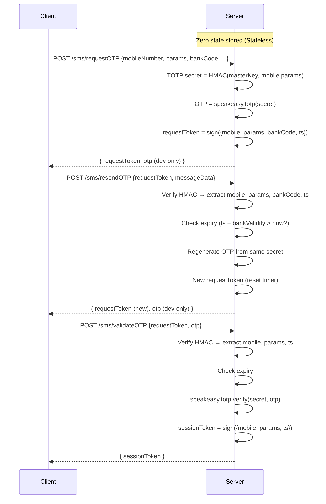

# 🚀 Walkthrough: Stateless TOTP OTP Service (v2)

> [!NOTE]
> This document explains the **Stateless TOTP OTP Service**. It includes both a **5th-Grade / Beginner-Friendly Explanation** with fun analogies and the **Full Technical Architecture**!

---

## 🎈 Part 1: How This Service Works (5th-Grade & Newcomer Edition)

Imagine you are going to an **Amusement Park** 🎟️, and you want to ride the big Rollercoaster. Before you get on, the park guard needs to verify your identity using a secret passcode sent to your phone!

```
  ┌──────────┐    1. Ask for OTP    ┌──────────────────────┐
  │          ├─────────────────────►│                      │
  │          │                      │    Guard Server      │
  │  Client  │◄─────────────────────┤ (Zero memory stored!)│
  │  (You)   │   2. Magic Envelope  └──────────────────────┘
  │          │   (requestToken) + OTP
  │          ├─────────────────────┐
  └──────────┘                     │ 3. Send Envelope + OTP
                                   ▼
                            ┌──────────────┐
                            │ Verified VIP │
                            │ SessionToken │
                            └──────────────┘
```

---

### 🎒 The Old Way vs. The New Way

| Concept | The Old Way (v1 - The Heavy Backpack) 🎒 | The New Way (v2 - The Magic Wax Seal) ✉️ |
|---|---|---|
| **Memory** | The guard writes down every kid's phone number & details in a **giant notebook** on his desk. | The guard has **ZERO notebooks** on his desk! (Stateless). |
| **Problem** | If 1,000,000 kids arrive, the notebook gets huge and slow. If the desk crashes, all records are lost! | No matter how many kids arrive, the server memory stays 100% empty and fast! |
| **How it works** | Server keeps track of everything. | The guard puts your details in a **Magic Sealed Envelope (`requestToken`)** and hands it to YOU! |

---

### 🔑 The 3 Main Steps (The 3 Doors)

#### 🚪 Step 1: Request OTP (`POST /sms/requestOTP`)
* **What you do:** You tell the guard: *"Hi! My phone number is 9876543210 and I want to login."*
* **What the guard does:**
  1. Uses the current time clock ⏰ and your phone number to calculate a **6-digit secret OTP** (like `482910`).
  2. Packs your phone number, timestamp, and bank code into a **Magic Envelope**.
  3. Seals it with a secret wax stamp (HMAC key) that only the guard can sign.
  4. Hands you back the **Magic Envelope (`requestToken`)** and sends the OTP to your phone.

#### 🔄 Step 2: Resend OTP (`POST /sms/resendOTP`)
* **What happens if SMS fails:** You didn't get the code!
* **What you do:** You **don't** need to type your phone number or bank details again! You just hand back the **Magic Envelope (`requestToken`)**.
* **What the guard does:**
  1. Checks the wax seal to make sure nobody tampered with the envelope.
  2. Reads the info inside, regenerates the exact same OTP using the clock secret, and gives you a fresh envelope!

#### ✅ Step 3: Validate OTP (`POST /sms/validateOTP`)
* **What you do:** You hand the guard your **Magic Envelope (`requestToken`)** + the **6-digit OTP** from your phone (`482910`).
* **What the guard does:**
  1. Verifies the wax seal on the envelope.
  2. Checks if the 2-minute timer has expired.
  3. Checks if your OTP matches the secret math formula.
  4. **Success!** Hands you a **VIP Gold Ticket (`sessionToken`)** proving you passed!

---

### 🧠 3 Big Words Explained Simply

1. **TOTP (Time-based One-Time Password):**
   * A magical clock formula that generates a new 6-digit code every 30 seconds. Both you and the server can figure out the code without storing it!
2. **HMAC (Hash-based Message Authentication Code / Magic Wax Seal):**
   * A digital lock seal. If someone tries to change the phone number in the token, the seal breaks instantly and the server says: *"Invalid Token!"*
3. **Stateless:**
   * The server doesn't remember who you are between requests. **The token carries all the proof!** This lets 100 servers work together in parallel seamlessly.

---

## 🏗️ Part 2: Technical Architecture & Implementation

### Sequence Diagram



---

### API Payload Specification

#### 1. POST `/sms/requestOTP` (Initial Request)
```json
{
  "user_name": "john_doe",
  "mobileNumber": "9876543210",
  "params": "txn123456abcd",
  "bankCode": "IDBI",
  "feature": "LOGIN",
  "operationPerformed": "OTP_VERIFICATION",
  "messageData": { "template": "otp_sms" }
}
```
**Response:**
```json
{
  "status": "SUCCESS",
  "message": "OTP sent successfully",
  "data": {
    "requestToken": "eyJhbGciOiJIUzI1Ni... (HMAC Signed Token)"
  }
}
```

#### 2. POST `/sms/resendOTP` (Optimized payload - 2 fields)
```json
{
  "requestToken": "<token from requestOTP>",
  "messageData": { "template": "otp_sms" }
}
```

#### 3. POST `/sms/validateOTP` (Minimal payload - 2 fields)
```json
{
  "requestToken": "<token from requestOTP or resendOTP>",
  "otp": "482910"
}
```
**Response:**
```json
{
  "status": "SUCCESS",
  "message": "OTP verified successfully",
  "data": {
    "sessionToken": "eyJhbGciOiJIUzI1Ni... (Proof of verification)"
  }
}
```

---

### Key Modules & File Structure

| File Link | Role & Responsibility |
|---|---|
| [hmac.helper.js](file:///d:/Kuldeep%20Pradhan/Projects/nsdlma/totp-service-be/utils/helper/hmac.helper.js) | Handles HMAC-SHA256 signing and timing-safe token validation (`crypto.timingSafeEqual`). |
| [sms.bl.js](file:///d:/Kuldeep%20Pradhan/Projects/nsdlma/totp-service-be/services/BL/sms.bl.js) | Business Logic for OTP generation, resend validation, and TOTP verification. |
| [sms.controller.js](file:///d:/Kuldeep%20Pradhan/Projects/nsdlma/totp-service-be/controller/sms.controller.js) | Express controller wrapping BL logic and returning formatted JSON responses. |
| [validateOtp.validator.js](file:///d:/Kuldeep%20Pradhan/Projects/nsdlma/totp-service-be/utils/validator/sms/validateOtp.validator.js) | Input schema validation enforcing `requestToken` + `otp`. |

---

### 🛡️ Security Guarantees

* **Tamper Proofing:** Every `requestToken` and `sessionToken` is cryptographically signed using `HMAC-SHA256`. Any payload alteration invalidates the signature.
* **Timing-Attack Resistance:** Token verification uses constant-time string comparison (`crypto.timingSafeEqual`) to prevent timing side-channel attacks.
* **Expiry Enforced:** Embedded timestamps guarantee tokens expire after the configured bank validity window (default 2 mins).
* **Horizontal Scaling:** Any application instance sharing the `TOTP_MASTER_KEY` can validate tokens without centralized session stores (Redis/DB).

---

### 🌐 Quick Server Endpoints

* **API Base URL:** `http://localhost:3000`
* **Interactive Swagger Documentation:** `http://localhost:3000/api-docs`
* **Service Heartbeat Check:** `http://localhost:3000/HbtChk`
